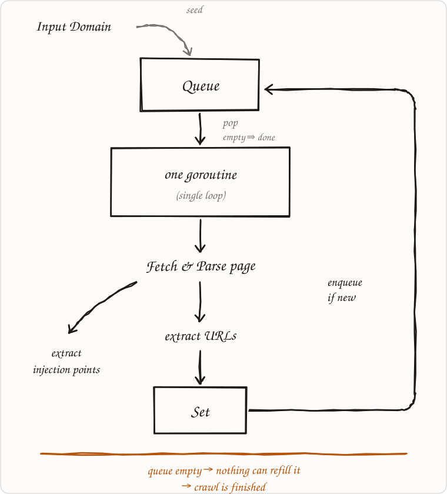
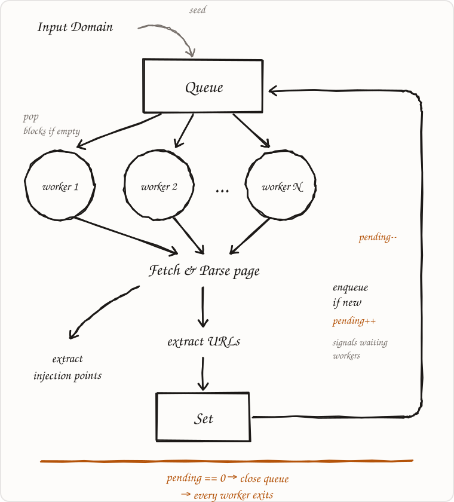

# Vet

**A web vulnerability checker across a domain.**

Vet tests web inputs for injection flaws like XSS and SQLi and for missing protections
like rate limiting. **Target** to check a single endpoint's fields, or
**crawl** to test every endpoint across a domain. Both are
available through the **CLI**.

---

## How it works

### The crawler

Crawl mode is a worker pool that discovers a domain's attack surface. Both a
single-threaded and a concurrent crawler ship in the tree, walking the same frontier
with the same scope and dedup rules — `--sequential` selects the former.

<table>
<tr>
<td width="50%" align="center"><b>Single-threaded</b></td>
<td width="50%" align="center"><b>Concurrent</b></td>
</tr>
<tr>
<td></td>
<td></td>
</tr>
</table>

The loop is identical; the stop condition is not. With one goroutine, an empty queue is
proof the crawl is over. With N workers an empty queue instead means "the others
are mid-fetch and about to refill it", so termination is tracked by a counter of
outstanding URLs. A URL is counted when it's enqueued and retired only after the links
it discovered are themselves counted, so the count cannot reach zero while the crawl is
still alive. Zero means no work in flight and no worker able to produce more — the
moment it's safe to close the queue and let every worker exit.

- **Scope enforcement at the frontier** — URLs outside the allowlist are never enqueued.
- **Canonicalization + dedup** — `?id=1` and `?id=2` aren't scanned as separate pages forever; a visited set (guarded for concurrent access) keeps the crawl finite.
- **Form + link discovery** — extracts links to follow and forms/params to test.
- **Politeness** — per-host rate limiting and backoff so a scan doesn't look like an attack.

The crawler's only job is to *find* injection points; testing them is the detection
engine's job. Keeping them separate is what makes both modes fall out of one codebase.

> Note: crawl mode currently follows server-rendered links and forms. JavaScript-rendered
> single-page apps (which need a headless browser) are a later addition — server-rendered
> targets like DVWA are fully covered.

### How detection actually works

N/A for now

---

## Usage

**Targeted** — Supply one endpoint and the fields to test.

```bash
vet check --target http://localhost:8080/login --scope localhost:8080 --params username,password
```

**Crawl** — Supply a domain. Vet discovers endpoints and forms across it (respecting
scope), then runs the full detection suite on every injection point it finds. Longer
running; produces a report over the whole surface.

```bash
vet scan --domain http://localhost:8080 --scope localhost:8080
```

---

## What it checks (WIP)

| Check | Strategy | Notes |
|-------|----------|-------|
| **Reflected XSS** | N/A | N/A |
| **SQLi (error-based)** | N/A | N/A |
| **SQLi (boolean-based)** | N/A | N/A |
| **SQLi (time-based / blind)** | N/A | N/A |
| **Missing rate limiting** | N/A | N/A |

---

## Project structure

```
vet/
├── cmd/
│   └── vet/          # CLI entrypoint — check + scan subcommands, calls engine
├── docs/images/      # diagrams used by this README
└── internal/
    ├── engine/       # orchestration: run checks against injection points, collect findings
    ├── checks/       # one file per vulnerability class (pluggable Check interface)
    ├── crawler/      # concurrent attack-surface discovery, feeds the engine
    ├── httpx/        # HTTP client wrapper: rate limiting + scope enforcement
    └── finding/      # the finding schema (shared contract for check + scan output)
```

---

